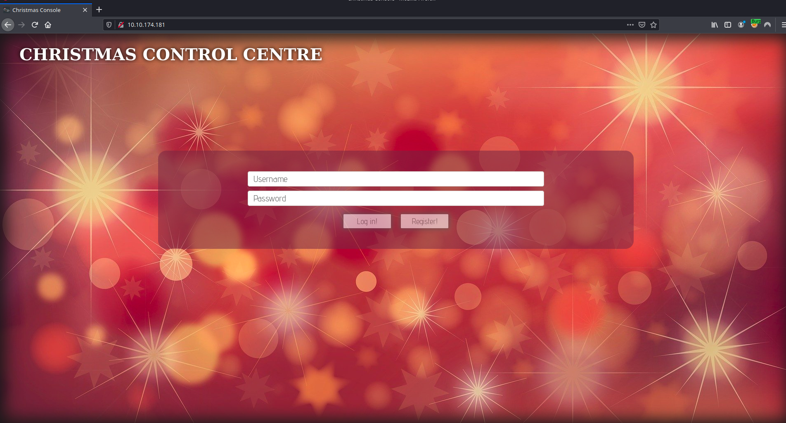
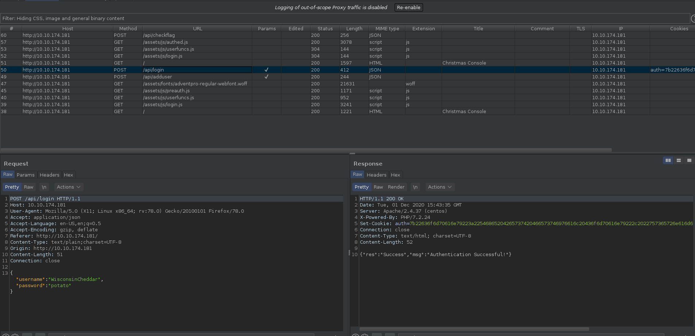
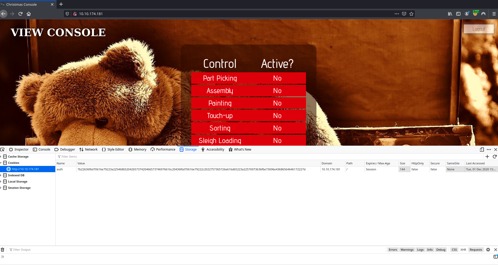
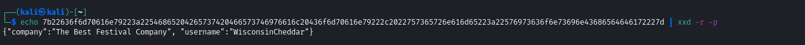
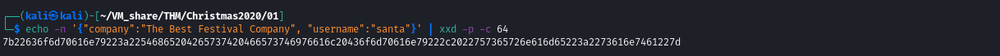
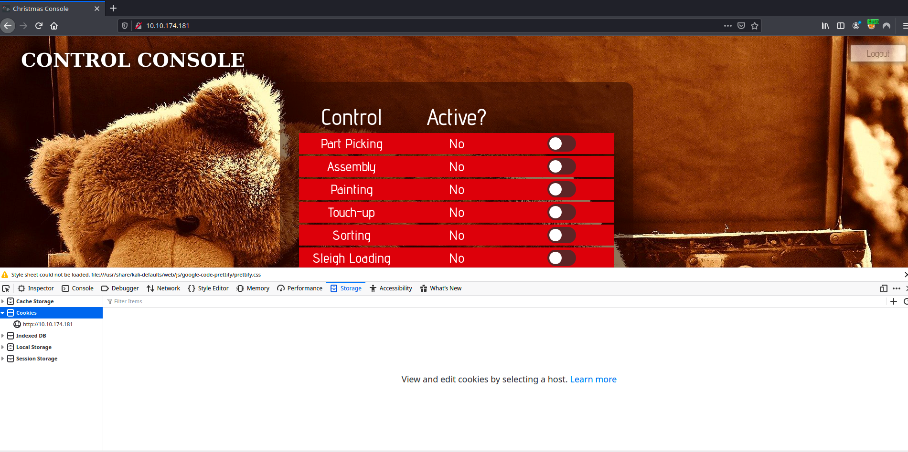
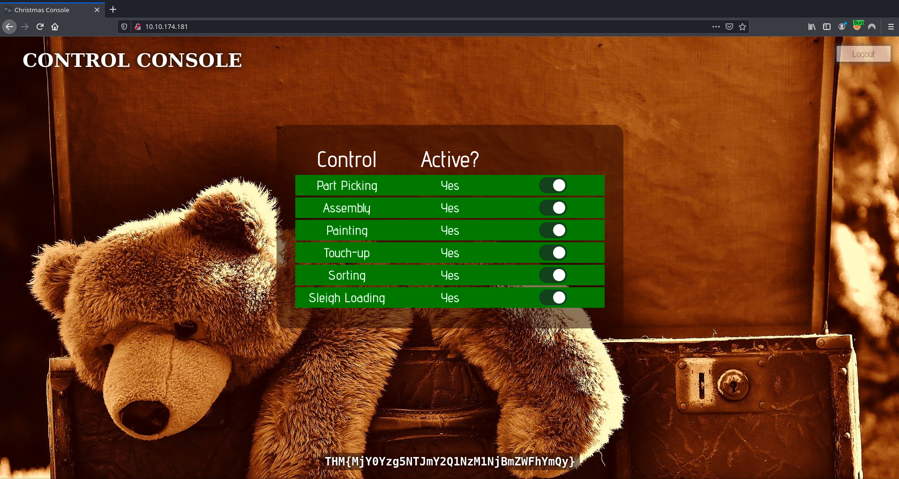

# Day 01

01 December 2020

# Questions

#### Deploy your AttackBox *(the blue "Start AttackBox" button*) and the tasks machine (*green button on this task*) if you haven't already. Once both have deployed, open FireFox on the AttackBox and copy/paste the machines IP into the browser search bar.

#### Register for an account, and then login.

#### What is the name of the cookie used for authentication?

`auth`

#### In what format is the value of this cookie encoded?

`hexadecimal` - identified by characters 0-9 & a-f

#### Having decoded the cookie, what format is the data stored in?

`JSON` - identified by pattern of curly braces, double quotes, colon, and comma seperated key/value pairs.

#### Figure out how to bypass the authentication.

#### What is the value of Santa's cookie?

`7b22636f6d70616e79223a22546865204265737420466573746976616c20436f6d70616e79222c2022757365726e616d65223a2273616e7461227d`

Generating the new cookie:

After refreshing the page with the new cookie:

#### Now that you are the santa user, you can re-activate the assembly line!

#### What is the flag you're given when the line is fully active?

`THM{MjY0Yzg5NTJmY2Q1NzM1NjBmZWFhYmQy}`

