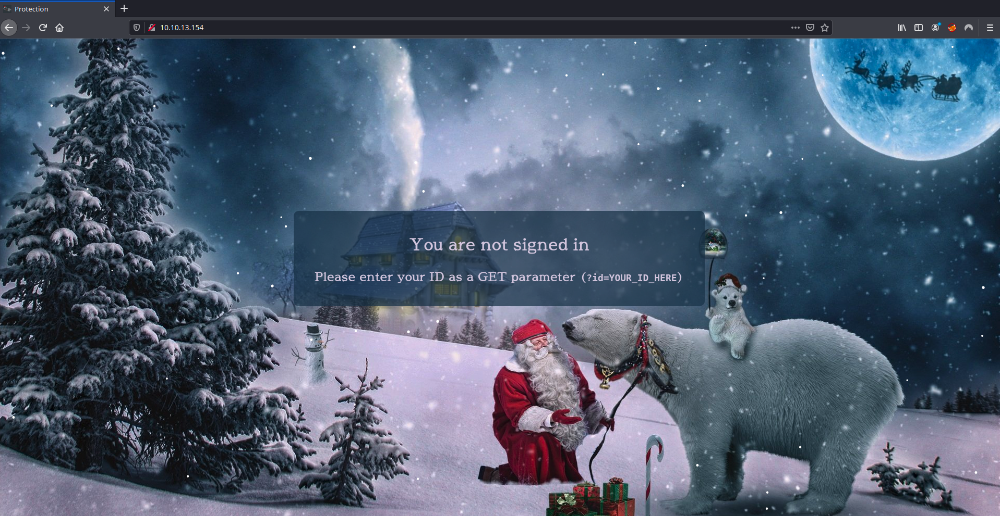
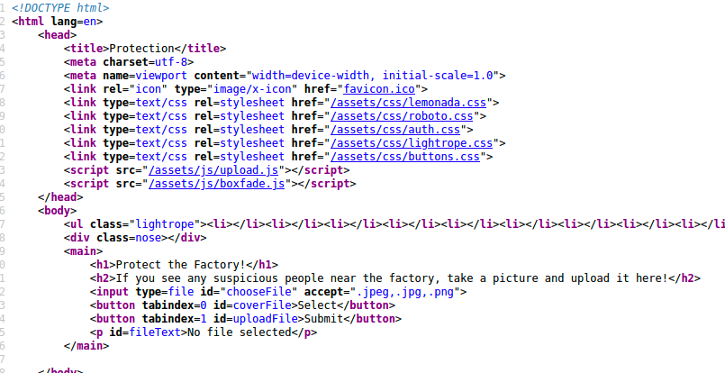
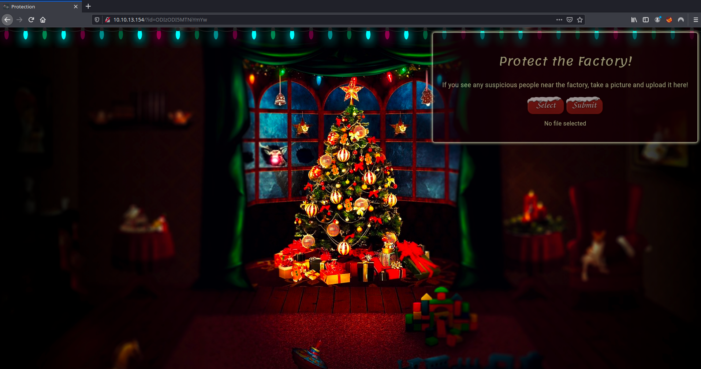
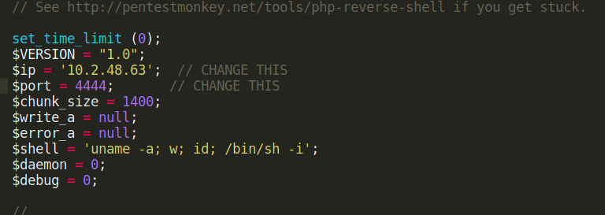
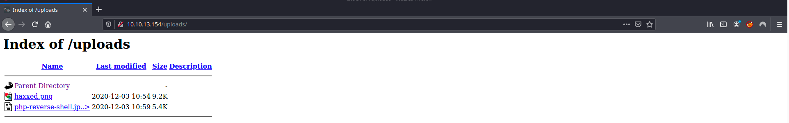
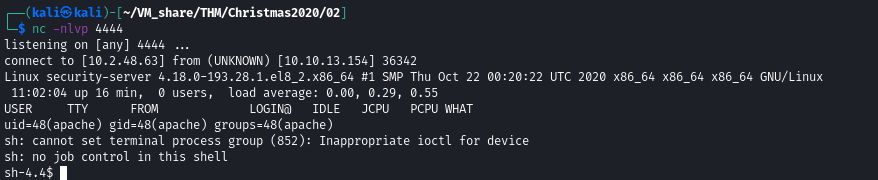
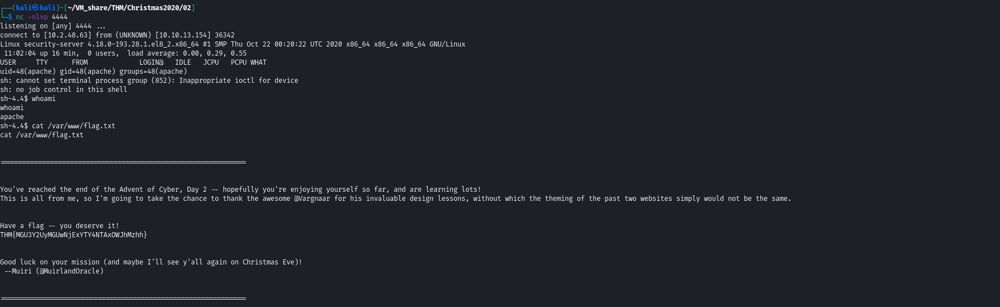

# Day 2

02 December 2020

### *Putting it all together*

This was a *lot* of information, so let's put it all together and look at the full process for exploiting a file upload vulnerability in a PHP web application:

1. Find a file upload point.
2. Try uploading some innocent files -- what does it accept? (Images, text files, PDFs, etc)
3. Find the directory containing your uploads.
4. Try to bypass any filters and upload a reverse shell.
5. Start a netcat listener to receive the shell
6. Navigate to the shell in your browser and receive a connection!

------

*At the bottom of the dossier is a sticky note containing the following message:*

> For Elf McEager:
> You have been assigned an ID number for your audit of the system: **`ODIzODI5MTNiYmYw`** . Use this to gain access to the upload section of the site.
> Good luck!

*You note down the ID number and **navigate to the displayed IP address (10.10.13.154) in your browser**.*

 Deploy

# Questions

#### What string of text needs adding to the URL to get access to the upload page?

**`?id=ODIzODI5MTNiYmYw`**

#### What type of file is accepted by the site?

#### Bypass the filter and upload a reverse shell.

#### In which directory are the uploaded files stored?

**`/uploads`**

#### Activate your reverse shell and catch it in a netcat listener!

#### What is the flag in `/var/www/flag.txt`?

**` THM{MGU3Y2UyMGUwNjExYTY4NTAxOWJhMzhh}**

